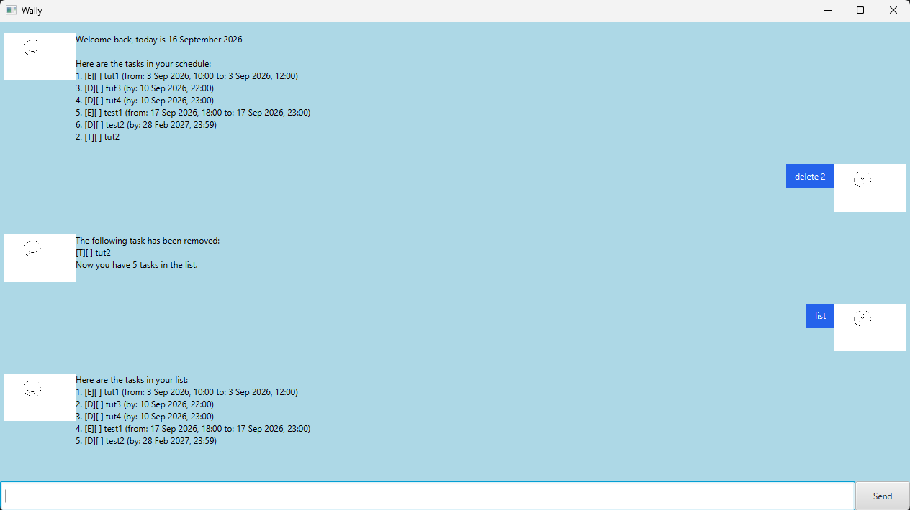

# Wally User Guide



Wally is a desktop task manager controlled through text commands. Track to-dos,
deadlines, and events, search your tasks, and view your schedule in date order.

## Getting started

1. Install Java 25.
2. If you have the packaged `wally.jar`, open a terminal in its folder and run
   `java -jar wally.jar`.
3. Type a command in the input field and press Enter or click **Send**.

To run from the source project, use `gradlew.bat run` on Windows or `./gradlew run`
on macOS/Linux from the project folder. Build the JAR with `gradlew.bat shadowJar`
or `./gradlew shadowJar`; the output is `build/libs/wally.jar`.

Wally opens in a resizable 1280 x 720 window with a light blue background. It
displays today's date and your saved schedule. For example, on 16 September 2026
with an empty task list:

```text
Welcome back, today is 16 September 2026

Here are the tasks in your schedule:
```

## Command conventions

- Use lowercase command words and the spacing shown in the examples.
- Replace `<description>` and other placeholders with your values, without the angle brackets.
- Dates and times use `yyyy-MM-dd HH:mm`, including leading zeroes and a 24-hour clock.
- Descriptions must be unique across all task types, including completed tasks.
  Duplicate checking ignores case and surrounding spaces.
- Task numbers start at 1. Use the numbers displayed by `list`, `schedule`, or `find`.
  Run `list` again after deletion because subsequent numbers change.

`[T]` means to-do, `[D]` means deadline, and `[E]` means event.
`[ ]` indicates incomplete; `[X]` indicates completed.

The examples below build on one another, starting with an empty task list.

## Adding to-dos

Add a task without a date or time.

Format: `todo <description>`

Example: `todo read textbook`

Wally adds the task to the end of your list:

```text
The following task has been added:
[T][ ] read textbook
Now you have 1 tasks in the list.
```

## Adding deadlines

Add a task with a due date and time.

Format: `deadline <description> /by <yyyy-MM-dd HH:mm>`

Example: `deadline submit assignment /by 2026-09-18 23:59`

```text
The following task has been added:
[D][ ] submit assignment (by: 18 Sep 2026, 23:59)
Now you have 2 tasks in the list.
```

## Adding events

Add a task with a start and end time. The start must be strictly before the end.
Events can span multiple days.

Format: `event <description> /from <yyyy-MM-dd HH:mm> /to <yyyy-MM-dd HH:mm>`

Example: `event team meeting /from 2026-09-17 10:00 /to 2026-09-17 11:00`

```text
The following task has been added:
[E][ ] team meeting (from: 17 Sep 2026, 10:00 to: 17 Sep 2026, 11:00)
Now you have 3 tasks in the list.
```

## Listing tasks

Show all tasks, including completed tasks, in the order they were added.

Example: `list`

```text
Here are the tasks in your list:
1. [T][ ] read textbook
2. [D][ ] submit assignment (by: 18 Sep 2026, 23:59)
3. [E][ ] team meeting (from: 17 Sep 2026, 10:00 to: 17 Sep 2026, 11:00)
```

An empty list displays only the heading.

## Viewing the schedule

Show dated tasks from earliest to latest, followed by to-dos. Deadlines are ordered
by their due time; events are ordered by their start time. Past and completed
tasks are included. Numbers retain their positions in `list`, so they can be
used directly in other commands.

Example: `schedule`

```text
Here are the tasks in your schedule:
3. [E][ ] team meeting (from: 17 Sep 2026, 10:00 to: 17 Sep 2026, 11:00)
2. [D][ ] submit assignment (by: 18 Sep 2026, 23:59)
1. [T][ ] read textbook
```

## Finding tasks

Search for a phrase in the displayed task text, including descriptions and
formatted dates. Matching ignores case. Results retain their original numbers.

Format: `find <search phrase>`

Example: `find MEETING`

```text
Here are the matching tasks in your list:
3.[E][ ] team meeting (from: 17 Sep 2026, 10:00 to: 17 Sep 2026, 11:00)
```

If nothing matches, only the heading is displayed.

## Marking tasks as completed

Mark a task as done using its number.

Format: `mark <number>`

Example: `mark 1`

```text
The following task has been marked as done:
[T][X] read textbook
```

## Marking tasks as incomplete

Change a completed task back to incomplete.

Format: `unmark <number>`

Example: `unmark 1`

```text
The following task has been marked as not done yet:
[T][ ] read textbook
```

## Deleting tasks

Remove a task using its number. There is no undo command.

Format: `delete <number>`

Example: `delete 1`

```text
The following task has been removed:
[T][ ] read textbook
Now you have 2 tasks in the list.
```

The remaining tasks are now numbered 1 and 2. You may reuse a deleted description.

## Changing the background

Change the chat background to black, white, or light blue. Wally adjusts its text
colour for readability; your message bubbles remain blue.

Format: `background <colour>`

Examples: `background black`, `background white`, `background light blue`

`background blue` also selects light blue. Colour names ignore case.
For `background light blue`, the response is:

```text
Background changed to light blue.
```

The selected background is saved immediately and restored when Wally restarts.
Light blue is used when no valid saved colour is available.

## Exiting Wally

Example: `bye`

Wally writes the task list to its save file, closes the window, and exits.
No additional chat message is displayed.

## Saving and loading

Wally automatically writes tasks after processing task commands and loads them
when it starts. No separate save command is needed.

The save location is `/wally/Saves/save.txt`, rooted at the filesystem root rather
than inside the project folder. On Windows it resolves on the current drive, for
example `C:\wally\Saves\save.txt`. Wally needs permission to create and write this
location. File errors are printed in the terminal.

Completion status is saved and restored on restart. Completed entries have an
`[X] ` prefix in the save file; older entries without this prefix load as incomplete.
Background colour is stored separately in `background.txt` beside the
task save file. If Wally cannot save a colour, it displays an error and keeps the
current background. Back up the save file before
editing it manually; invalid or duplicate task entries are skipped on load.

## Handling errors

For the validation errors below, Wally displays a message and leaves the task
list unchanged. Correct your command and send it again.

| Problem | Message |
| --- | --- |
| Duplicate description | `A task with this description already exists.` |
| Impossible date or time, such as `2026-02-30 12:00` or `2026-09-18 24:00` | `Invalid date or time. Use a valid date and time in yyyy-MM-dd HH:mm format.` |
| Event start equal to or later than its end | `Event start must be before end.` |
| Incorrect deadline syntax | `Format: deadline <name> /by <date: yyyy-MM-dd> <time: HH:mm>` |
| Incorrect event syntax | `Format: event <name> /from <date: yyyy-MM-dd> <time: HH:mm> /to <date: yyyy-MM-dd> <time: HH:mm>` |
| Task number outside the list | `Enter an index between 1 and N`, where `N` is the task count. |
| Marking, unmarking, or deleting from an empty list | `You have no tasklist yet!` |
| Unsupported or missing background colour | `Only black, white and blue supported`. The background stays unchanged. |
| Unknown command | `Invalid Command Entered!` |

Use non-empty descriptions and search phrases. The current parser treats command
words and delimiters as separators: avoid repeating `todo`, `deadline`, or `event`
followed by a space inside their corresponding task descriptions. Avoid `/by`,
`/from`, or `/to` as description text in dated tasks.

## Command summary

| Action | Command |
| --- | --- |
| Add a to-do | `todo <description>` |
| Add a deadline | `deadline <description> /by <yyyy-MM-dd HH:mm>` |
| Add an event | `event <description> /from <yyyy-MM-dd HH:mm> /to <yyyy-MM-dd HH:mm>` |
| List tasks | `list` |
| View schedule | `schedule` |
| Find tasks | `find <search phrase>` |
| Mark completed | `mark <number>` |
| Mark incomplete | `unmark <number>` |
| Delete a task | `delete <number>` |
| Change background | `background <black/white/light blue>` |
| Exit | `bye` |
